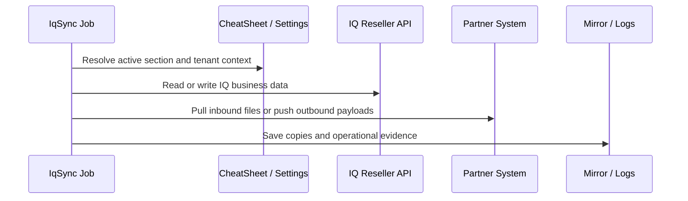

# Data Flow

IQ Connect integrations follow the same broad lifecycle even when each partner has a different protocol or data format.

## Outbound pattern

1. Read candidate records from IQ or integration tables.
2. Enrich records with tenant/integration settings.
3. Format partner-specific XML, CSV, JSON, or API payloads.
4. Send through SFTP or REST.
5. Mark records complete through sync flags or integration tables.

## Inbound pattern

1. Pull partner files or receive a webhook.
2. Save the original payload to a mirror location.
3. Transform partner data into IQ API requests.
4. Post to IQ and preserve the response.
5. Send acknowledgements or updates when required.
