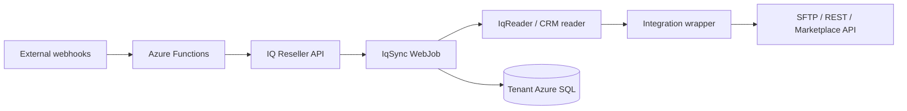

# System Map

IQ Connect is organized around a hub-and-spoke model. `IqSync` is the hub, and each integration wrapper translates IQ Reseller data into an external protocol, file format, or API shape.

## Core Flow

## Main Components

| Component | Role |
| --- | --- |
| `IqSync` | Command-line orchestration engine deployed as Azure WebJobs. |
| `CheatSheet` | Runtime settings object for tenant, IQ API, Azure, and integration configuration. |
| `IqReader` | Reads IQ Reseller source data and feed-specific SQL/API query results. |
| Integration wrappers | Format partner-specific payloads for fulfillment, CRM, catalog, and marketplace feeds. |
| `VssLastMile` | Azure service used for SQL query execution and SFTP marshaling. |
| Azure Functions | Receive webhook-style inbound events, especially quote-to-order flows. |
| `iqconnect_*` tables | Store sync state, mappings, feed history, resend queues, and CRM tracking. |

## Integration Categories

| Category | Purpose |
| --- | --- |
| Fulfillment / Symphony | Catalog, inventory, pricing, POs, SO updates, ASN, invoices, returns, and cancellations. |
| EDI / SPS | Order, shipment, invoice, and acknowledgement workflow. |
| CRM / HubSpot | Company, contact, deal, line item, gross margin, and quote-to-order workflows. |
| Catalog / Channable | Product catalog feed generation for marketplace distribution. |

## Direction Conventions

| Command Prefix | Direction | Example |
| --- | --- | --- |
| `from-bestbuy` | External partner to IQ Reseller | Partner sends a PO to IQ. |
| `to-bestbuy` | IQ Reseller to external partner | IQ sends ASN, invoices, catalog, or ETA updates. |
| `from-sps` / `to-sps` | Bidirectional with SPS Commerce | SPS orders in; ASN and invoices out. |
| `to-hubspot` | IQ Reseller to HubSpot | Deals, companies, contacts, and gross margin sync. |
| `to-channable` | IQ Reseller to Channable | Catalog feed generation. |

## Design Principles

- WebJobs run unattended on schedules or by manual support command.
- Most data movement stays inside Azure until the final partner handoff.
- Tenant context is resolved at runtime from command arguments and tenant configuration.
- Delta mode is preferred for recurring feeds; reset mode is reserved for full reloads.
- Mirror files and feed history are the first stop for support evidence.
